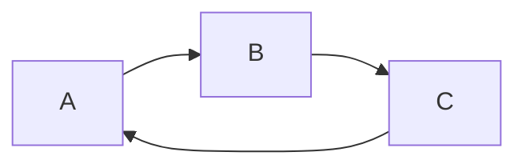
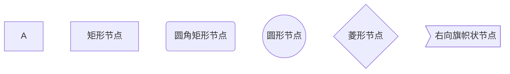
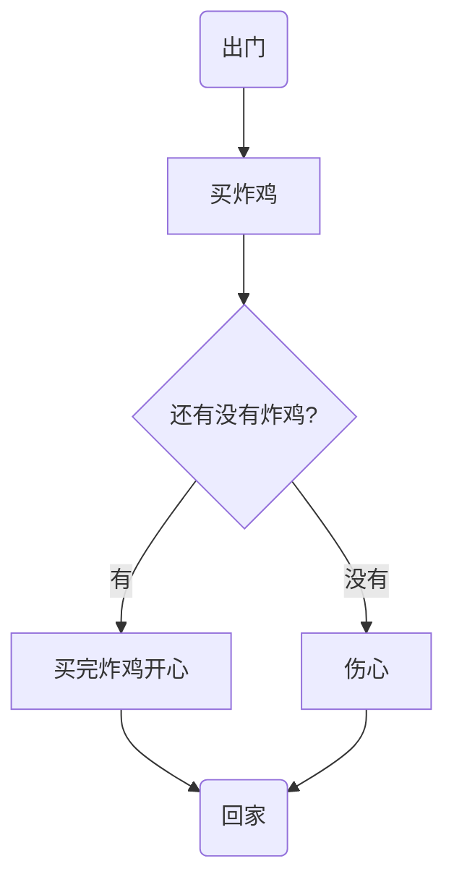

# 基础篇

## 简单字体

~~波浪号删除~~

*星号斜体*

**2星号加粗**

***倾斜加粗***

<u>下划线</u>

==高亮==

水 H~2~O O~2~

面积m^2^

表情符号   :smile:  :relieved: :smirk: :speak_no_evil: 

## 表格

```markdown
name | price
--- | ---
fried chicken | 19
cola | 5
```


|     name      | price |
| :-----------: | :---: |
|      ---      |  ---  |
| fried chicken |  19   |
|     cola      |   5   |


```markdown
|    name       | price |
| :------------ | :---: |
| fried chicken |  19   |
| cola          |  32   |
```

## 引用

> "后悔"   >
> 也可以在引用中
>
> > 使用嵌套的引用
## 列表

### 无序列表

* 星号*
  + 也可以用+
    - 或者- 

### 有序列表

1. 

2. 数字+.

3.  


## 代码

### 代码块

```java
public static void main()
```


```c
int main()
```
### 行内代码
```markdown
也可以通过'',插入行内代码（）
例如`markdown
​```
```

`markdown`

#### 转换规则

代码块中的文本都会显示为原始内容

## 分割线

***


---

*, -, _, 3+个可以显示分割线

___

## 跳转

### 外部跳转-超链接

[link text](link)

[帮助文档](https://support.typora.io/Links/#faq)

### 内部跳转

[我想跳转](#饼图（pie）)（只能跳到标题，不能跳到正文）

自动链接<444186810@qq.com>

## 图片

### 网上图片


没有指定图片


# 画图篇

## 流程图






### example



## 序列图sequence diagram

```markdown
[参与者1][消息线][参与者2]:消息体
```


```sequence
Title:买炸鸡
救救->>炸鸡店小哥:还有炸鸡吗？
炸鸡店小哥--X救救:没有，要现炸
```


```sequence
Title: reflection
```
